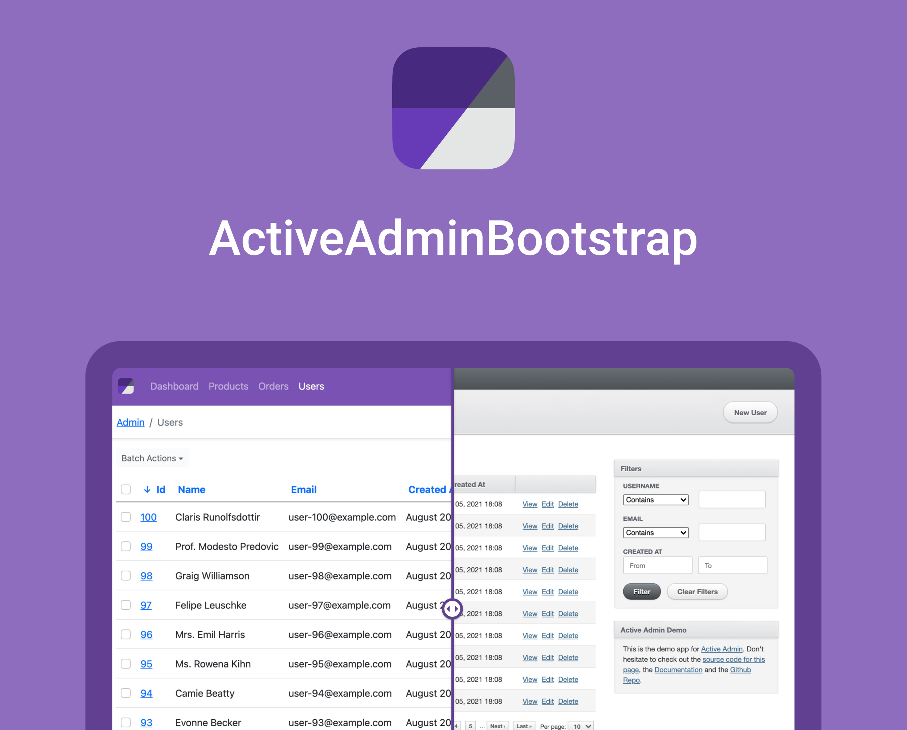

# Adminterface <!-- omit in toc -->
[](https://github.com/CMDBrew/adminterface/actions/workflows/ci.yml)
[](https://codeclimate.com/github/CMDBrew/adminterface/maintainability)
[](https://codeclimate.com/github/CMDBrew/adminterface/test_coverage)
[](https://rubygems.org/gems/adminterface)
[](https://www.npmjs.com/package/@cmdbrew/adminterface)

A gem that brings Bootstrap 5, advanced customizability, and other goodies into ActiveAdmin

[](https://adminterface.io)

## Dependencies
- [Ruby](https://www.ruby-lang.org/en/) >= 2.7
- [Rails](http://rubyonrails.org/) >= 6.0
- [ActiveAdmin](https://github.com/activeadmin/activeadmin) ~> 2.9
- [Bootstrap](https://getbootstrap.com/) ~> 5.1.3
- [Webpacker](https://github.com/rails/webpacker) ~> 5.0

## Get Started
- [Documentation](https://adminterface.io/docs/intro)
- [Demo](https://demo.adminterface.io)
- [Issue tracker](https://github.com/CMDBrew/adminterface/issues)
- [Discussions and feature requests](https://github.com/CMDBrew/adminterface/discussions)

## Installation
1. Add the following to your application's Gemfile:
   ```ruby
   gem "adminterface"
   ```
2. Then execute:
   ```bash
   $ bundle install
   ```
3. Install ActiveAdmin (If you haven't)
   ```bash
   $ rails g active_admin:install --use_webpacker
   ```
4. Install Adminterface

   > This command will ask for permissions to overwrite files generated by ActiveAdmin. Make sure to review the files carefully and accept them.
   > We recommend you commit your files before running this command to ensure you are aware of the changes made.

   ```bash
   $ rails g adminterface:install
   ```
5. Migrate your database and start the server
   ```bash
   $ rails db:migrate
   $ rails server
   ```

## Contributing
See [CONTRIBUTING.md](CONTRIBUTING.md).

## License
Adminterface is free for personal and non-commercial use and with a yearly subscription for commercial purposes. See our [Terms of Service in full text](LICENSE.md) for more information.

### For Commerical License
Get a license at https://adminterface.io/pricing, then create and add the `license_key` into the following file in your project:
```ruby
# config/initializers/adminterface.rb
Adminterface.setup do |config|
  config.license_key = "**********************"

  ## Use Rails credentials:
  ## doc: https://edgeguides.rubyonrails.org/security.html#custom-credentials
  # config.license_key = Rails.application.credentials.adminterface[:license_key]

  ## Or, use environment variables:
  # config.license_key = ENV["ADMINTERFACE_LICENSE_KEY"]
end
```
